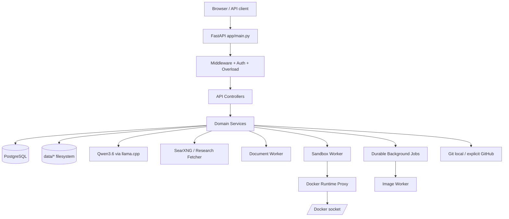
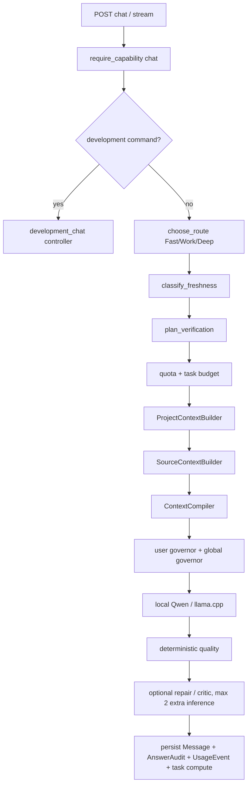
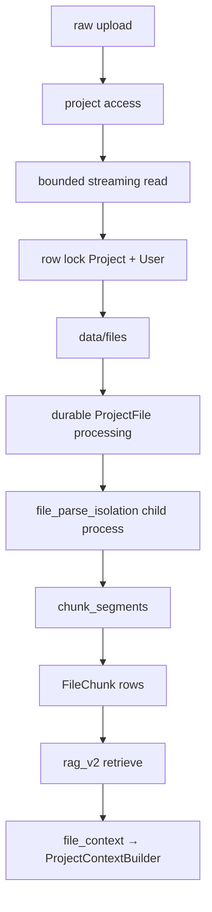
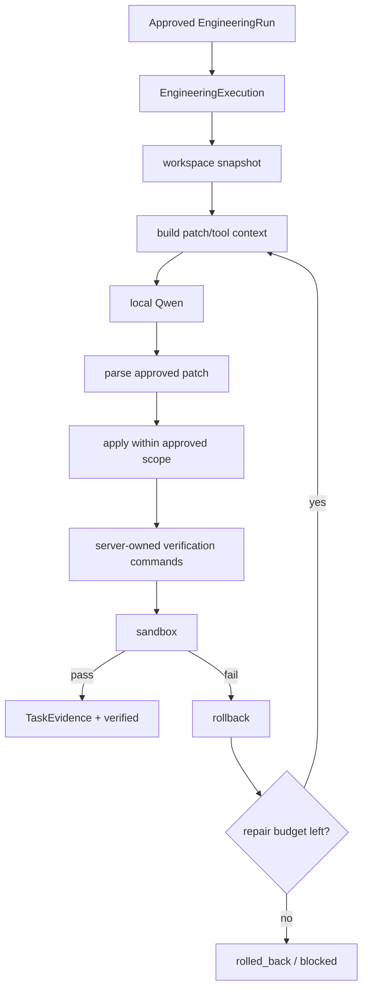
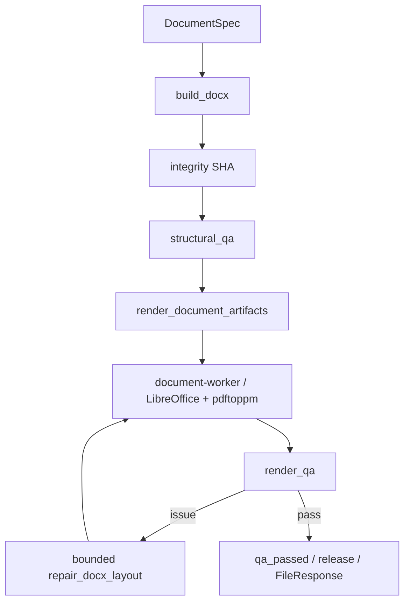
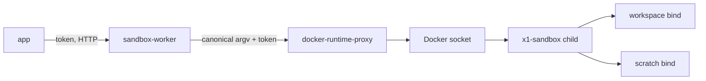

# OLYA AI / X1 — карта системы, контроллеров и связей

> **ОБЯЗАТЕЛЬНО ПРОЧИТАТЬ ПЕРЕД ИЗМЕНЕНИЕМ ПРОЕКТА.**  
> Этот файл — навигационная карта проекта для разработчиков и ИИ-агентов. Он отвечает на вопросы: **куда приходит запрос, какой контроллер его принимает, какой service выполняет бизнес-логику, какие ORM-модели/файлы/воркеры затрагиваются и где проходит граница безопасности**.
>
> Актуальность карты: 2026-09-11. Карта составлена по `main` после Sprint 67.
> **Правило проекта:** если в том же commit добавляется/удаляется controller, worker API, основной service, route prefix или меняется важная межмодульная связь — этот файл должен обновляться в том же commit.

---

## 1. Как пользоваться этой картой

Перед любой правкой сначала найдите путь функции по цепочке:

```text
UI / внешний API
        ↓
app/main.py
        ↓
middleware / auth / overload / capability
        ↓
app/api/routes/<controller>.py
        ↓
app/services/<service>.py
        ↓
ORM / filesystem / llama.cpp / SearXNG / worker
        ↓
response + audit + telemetry + durable state
```

Контроллеры должны оставаться HTTP-слоем: валидация HTTP-запроса, права, вызов service, перевод доменной ошибки в HTTP-код. Бизнес-логику нельзя копировать в новый controller, если соответствующий service уже существует.

Если задача связана с чатом — начинайте с `app/api/routes/chat.py`. Если с проектной разработкой — с `development_chat.py`, затем `development.py`, `engineering.py`, `execution.py`, `sandbox.py`, `git.py`. Если с файлами и RAG — с `files.py` → `file_parse_isolation.py` / `app/services/files.py` → `rag_v2.py` → `file_context.py`. Если с релизом — с `reliability.py`, `launch.py`, `scripts/release_gate.py`, `scripts/rc_release_candidate.py`.

---

## 2. Карта системы за 30 секунд



Главная идея архитектуры: **FastAPI не должен напрямую владеть опасными внешними процессами**. LLM работает отдельным llama.cpp-процессом; LibreOffice — через document-worker; sandbox Docker — через sandbox-worker → минимальный docker-runtime-proxy; длительные image-задачи — через durable job queue.

---

## 3. Главные точки входа и source of truth

| Файл | Назначение |
|---|---|
| `app/main.py` | Единственная точка сборки FastAPI: lifespan, middleware, governors, concrete router registration, background loops. |
| `app/core/config.py` | Все runtime-настройки `X1_*`; лимиты CPU/RAM/context/files/research/sandbox/images/launch. |
| `app/db.py` | SQLAlchemy engine, pool/deadlines, `SessionLocal`, `get_db`, `Base`. |
| `app/models.py` | Канонический ORM registry: readable core, migration-derived models и Sprint extensions. |
| `app/models_core.py` | Базовые ORM-модели и общий declarative helper. |
| `app/models_migrations.py` | Детерминированно сгенерированные ORM-модели из Alembic chain. |
| `app/schemas/*` | Pydantic HTTP/domain contracts. |
| `app/api/routes/*` | HTTP controllers. |
| `app/services/*` | Основная доменная логика. |
| `app/inference/client.py` | HTTP-клиент llama.cpp: chat, streaming, native tool turns. |
| `app/inference/router.py` | Fast / Work / Deep routing. |
| `docker-compose.yml` | Production topology и resource envelopes. |
| `model-manifest.json` | Пин модели Qwen/GGUF и контроль целостности. |
| `regression/golden_corpus.json` | Golden model/prompt regression cases. |
| `scripts/release_gate.py` | Полный release gate. |
| `scripts/rc_release_candidate.py` | Финальный RC gate целевого 32-GiB узла. |
| `ARCHITECTURE.md` | Историческая/концептуальная архитектура. Этот `PROJECT_SYSTEM_MAP.md` — оперативная карта текущего кода. |

### ORM registry

`app/models.py` собирает единый metadata graph из читаемых базовых моделей, детерминированного migration-derived registry и расширений:

```text
models_sprint27.py
models_sprint29.py
models_sprint30.py
models_sprint31.py
models_sprint37.py
models_sprint38.py
models_sprint45.py
models_sprint51.py
models_sprint53.py
models_sprint59.py
models_sprint61.py
models_sprint62.py
```

`scripts/generate_orm_models.py --check` подтверждает, что `models_migrations.py` синхронизирован с Alembic. Все модули используют один `app.db.Base`. **Не создавайте второй SQLAlchemy Base и не импортируйте только часть model registry в production-код.**

Alembic имеет один непрерывный граф от `bff29ea4eab8` до единственного head. Чистый `upgrade head` создаёт 94 application tables, а `alembic check` не допускает расхождение DDL и ORM metadata.

---

## 4. Что создаёт `app/main.py`

Routers регистрируются как concrete routes через `_include_router_eager`. Это сохраняет dependency overrides FastAPI и одновременно делает `app.routes` полным источником для release-аудитов. Вложенные onboarding и image-editing routers подключаются явно, а не скрываются в lazy `_IncludedRouter`.

При старте приложения создаются и кладутся в `app.state`:

- `settings` — `Settings` из `app/core/config.py`;
- `llama` — `LlamaClient`;
- `context` — `ContextCompiler`;
- `governor` — глобальный bounded inference `ResourceGovernor`;
- `file_upload_governor` — отдельный admission для uploads;
- `user_governor` — per-user inference concurrency;
- `overload_lanes` — `chat`, `research`, `images`, `sandbox`;
- render gate документов;
- `research` — `ResearchFetcher`;
- `discovery` — `ProviderPoolDiscovery`, обычно `SearxngDiscovery`, опционально Brave.

В production запускаются фоновые циклы:

```text
beta_operations_loop
public_launch_watchdog_loop
maintenance_loop
```

Production startup fail-closed: SQLite, default admin token, default runtime/sandbox/document-worker secrets и некорректный worker URL блокируют запуск.

### Middleware до controllers

1. `RequestBodyLimitMiddleware` — общий streaming body limit, включая защиту от неоднозначного `Content-Length`.
2. `GZipMiddleware`.
3. `file_upload_admission` — ограничивает параллельные project uploads.
4. `graceful_overload_admission` — bounded lanes и circuit breaker до тяжёлой логики.
5. `privacy_headers` — no-store/noindex/security headers для `/v1`, `/app`, admin UI.

Global DB errors переводятся в контролируемые `409/503`, а не отдаются как raw trace.

---

# 5. Полный реестр HTTP controllers

Ниже перечислены **все 34 controller-модуля** из `app/api/routes`.

## 5.1 Account / identity / projects

### `app/api/routes/auth.py` — `/v1/auth`

Назначение: регистрация, вход и lifecycle сессии.

Основные endpoints: `register`, `login`, `me`, `logout`, `logout-all`.

Связи:

```text
auth controller
 → auth_rate_limit
 → app.services.auth
 → User / AuthSession
 → PostgreSQL
```

Ключевые правила: пароль — scrypt; bearer token хранится в БД только как digest; login несуществующего пользователя выполняет dummy scrypt для уменьшения timing enumeration; session count ограничивается.

### `app/api/routes/account.py` — `/v1/account`

Назначение: экспорт пользовательских данных и деактивация аккаунта.

Связи: `User`, `AuthSession`, `Project`, `ProjectMember`, `Conversation`, `Message`, `ProjectMemory`, `ProjectFile`, `Task`, `TaskEvidence`, `UsageEvent`.

`/export` собирает только принадлежащие/созданные этим пользователем данные. `/deactivate` отключает `User` и отзывает активные sessions.

### `app/api/routes/projects.py` — `/v1/projects`

Назначение: CRUD проектов и участников, а также bounded project workspace snapshot.

Связи:

```text
projects controller
 → access.py
 → project_workspace.py
 → Project / ProjectMember / User
 → Conversation / ProjectFile / ProjectMemory / Task / DevelopmentPlan
```

Owner создаёт проект. `viewer` читает, `member` работает, `manager` управляет проектом; membership меняет только owner.

`GET /v1/projects/{project_id}/workspace` — центральный Sprint 63 overview. Он возвращает только bounded previews и счётчики, не загружая Message, FileChunk, evidence или полный development plan. Все выборки выполняются после canonical project RBAC.

### `app/api/routes/conversations.py` — `/v1/conversations`

Назначение: persisted chat history и прозрачная conversation-memory.

Models: `Conversation`, `Message`, `ConversationMemory`.

Personal conversation доступна owner; project conversation — через `require_project_role`. Отсюда UI читает историю и Sprint 45 memory.

### `app/api/routes/memory.py` — `/v1/projects/{project_id}/memory`

Назначение: явная project memory key/value.

Model: `ProjectMemory`.

Viewer читает; member добавляет/обновляет/удаляет. Это **не то же самое**, что `ConversationMemory`: project memory — долгоживущие факты проекта, conversation memory — память отдельной беседы.

---

## 5.2 Chat / quality / usage / diagnostics

### `app/api/routes/chat.py` — `/v1`

**Главный пользовательский AI-controller.** Обслуживает обычный и streaming chat.

Основная цепочка:



Зависит от:

- `app.inference.router.choose_route`;
- `ProjectContextBuilder`;
- `ContextCompiler`;
- `SourceContextBuilder`;
- `freshness.py`;
- `conditional_verification.py`;
- `quality.py`;
- quota/task/resource governors;
- `safety.require_capability`;
- `diagnostics.py`.

Models: `Conversation`, `Message`, `Project`, `Task`, `AnswerAudit`, `UsageEvent`.

**Не создавайте альтернативный chat pipeline.** API key chat также вызывает этот controller.

### `app/api/routes/quality.py` — `/v1/quality`

Read-only пользовательский доступ к `AnswerAudit`.

Связь: Chat создаёт audit → Quality controller показывает его владельцу.

### `app/api/routes/usage.py` — `/v1/usage`

Назначение: usage summary, текущий бюджет и budget preview.

Связи:

```text
UsageEvent
Quota
budget_transparency
choose_route
freshness
conditional_verification
```

`budget-preview` использует тот же route/verification planning, что chat, чтобы прогноз не расходился с реальным pipeline.

### `app/api/routes/diagnostics.py` — `/v1/diagnostics`

Принимает ограниченный набор client-side frustration events: `cancelled`, `regenerated`, `stream_error`, `ui_error`, `response_not_useful`.

Пишет `FrustrationEvent` через `app.services.diagnostics`. Клиент не может прислать произвольные поля — metrics allowlisted.

---

## 5.3 Files / RAG / Internet research

### `app/api/routes/files.py` — `/v1/projects/...`

Назначение: project file lifecycle и lexical/RAG search.

Upload flow:



Services:

- `app.services.files` — filename/storage/hash, DOCX/XLSX/PDF/text parsing primitives, chunking;
- `file_parse_isolation.py` — killable child parser + queue + RLIMIT;
- `rag_v2.py` — hybrid lexical scoring/diversity/neighbors;
- `file_context.py` — bounded context + FILE_REF + prompt-injection quarantine + secret redaction.
- `file_citations.py` — resolves model-emitted FILE_REF values against project/file/chunk rows and returns bounded source fragments; model-authored metadata is never trusted.

Lifecycle recovery:

- failed, timed-out and restart-interrupted rows remain visible as `error` and outside RAG;
- manager retry reuses the stored immutable upload and rebuilds chunks transactionally;
- manager can select any `ready` version as current or delete a version;
- current-only listing still includes failed/processing rows so errors cannot disappear from the UI.

Storage: `data/files/...`.

### `app/api/routes/research.py` — `/v1/research`

Два уровня:

1. `ResearchSource` snapshot/evidence APIs — fetch URL, list sources, lexical search, exact evidence.
2. persisted `ResearchRun` — plan → discover → collect.

Связи:

```text
research controller
 → ResearchFetcher (SSRF-safe HTTP)
 → discovery provider pool
     → SearXNG (default)
     → Brave (optional if configured)
 → research_planner
 → ResearchRun / ResearchSource / SourceEvidence
 → SourceContextBuilder
 → chat quality/freshness
```

Сеть нельзя добавлять в Chat напрямую: актуальные внешние данные идут через research/source pipeline.

---

## 5.4 Canonical task engine

### `app/api/routes/tasks.py` — `/v1`

Назначение: server-owned task state machine и acceptance criteria.

Models: `Task`, `TaskCriterion`, `TaskEvidence`, `TaskCheckpoint`.

Transitions: create → running/waiting/verifying → completed/failed/cancelled. Используется optimistic `state_version`.

`Task` — канонический объект для долгой работы. Engineering/development не должны объявлять работу завершённой, если task acceptance/evidence этого не подтверждают.

Service: `app.services.tasks`.

---

## 5.5 Code workspace / project development

### `app/api/routes/code.py` — `/v1/code`

Назначение: низкоуровневый workspace API и ранний/manual CodeAgentRun API.

Models: `CodeWorkspace`, `CodeAgentRun`, `Task`.

Возможности: создать workspace, import ZIP, repo map, читать/писать файл с optimistic SHA, создать agent-run, ограничить allowed paths, выполнять разрешённые команды.

Service: `code_workspace.py`.

**Важно:** это не главный автономный Sprint 50 pipeline. Современная безопасная implementation-цепочка проходит через `engineering.py` → `execution.py` → `coding_agent.py` / `coding_tools.py` / `tool_reliability.py` → sandbox.

### `app/api/routes/runtime.py` — `/v1/project-runtimes`

Назначение: runtime, snapshots и encrypted secrets для проекта.

Models: `ProjectRuntime`, `ProjectRuntimeSnapshot`, `ProjectRuntimeSecret`, `CodeWorkspace`, `GitRepositoryBinding`.

Create runtime:

```text
CodeWorkspace
 → host resource envelope check
 → ensure_local_repo
 → data/project_runtimes/<runtime>
 → runtime manifest
 → local GitRepositoryBinding
```

Secrets шифруются `project_runtime_secret_key`; API списка secrets не возвращает plaintext.

### `app/api/routes/development.py` — `/v1/development-plans`

Назначение: высокоуровневый roadmap продукта.

Models: `DevelopmentPlan`, `DevelopmentSprint`, `DevelopmentCheckpoint`, work items/decisions через service.

`architect-draft` вызывает локальный Qwen Deep, после чего output проходит JSON/schema validation и превращается в persisted DevelopmentPlan. Есть replan, decisions, sprint activate/refresh/complete, checkpoints.

Service: `app.services.development`.

### `app/api/routes/engineering.py` — `/v1/engineering-runs`

Назначение: роли инженерной команды поверх конкретного `DevelopmentWorkItem`.

Models: `EngineeringRun`, `DevelopmentWorkItem`, `Task`, `UsageEvent`.

Flow:

```text
DevelopmentWorkItem
 → EngineeringRun
 → current_role
 → build_role_messages
 → local Qwen
 → parse_role_output
 → persist_role_result
 → next role / approved
```

Architect/reviewer используют reasoning; compute учитывается в task/quota.

### `app/api/routes/execution.py` — `/v1/engineering-executions`

**Канонический implementation + proof controller.**

Models: `EngineeringExecution`, `EngineeringRun`, `ProjectRuntime`, `Task`, `TaskEvidence`, `UsageEvent`.

Flow:



Нельзя считать model prose доказательством. Proof строится из server-observed diff/command exit codes/evidence.

### `app/api/routes/development_chat.py` — `/v1/development-chat`

Назначение: conversational control plane над всей development state machine.

Это **намеренная controller-to-controller orchestration связь**:

```text
development_chat
 → prepare_next_step
 → engineering.execute_role controller
 → execution.execute controller
 → commit_verified_execution
 → autonomous_development ledger/checkpoint
 → Conversation/Message
```

Команды: status/pause/resume/rollback/next и явные development control actions.

Обычный Chat при распознанной development command делегирует сюда динамически.

### `app/api/routes/sandbox.py` — `/v1/project-sandboxes`

Назначение: persisted verification runs и internal previews.

Models: `ProjectSandboxRun`, `ProjectPreviewSession`, `EngineeringExecution`, `ProjectRuntime`, `CodeWorkspace`.

Связь:

```text
sandbox controller
 → app.services.sandbox
 → remote sandbox-worker:8090
 → docker-runtime-proxy:8092
 → Docker socket
 → x1-sandbox runtime container
```

Sandbox run требует approved engineering scope. Preview требует `EngineeringExecution.status == verified`. Preview после health check получает `healthy_internal`; наружу автоматически не публикуется.

### `app/api/routes/git.py` — `/v1/git`

Назначение: Git lifecycle проекта.

Models: `GitRepositoryBinding`, `GitOperation`, `ProjectRuntimeSecret`, `CodeWorkspace`.

Service: `git_collaboration.py`.

Возможности: binding, init, clone, status, diff, secret scan, commit, fetch, push.

Внешние GitHub reads/writes требуют explicit confirmation; push требует `push_enabled`, manager role, secret scan и expected local/remote heads. GitHub credential берётся из encrypted runtime secret.

**Hard invariant:** `.git` должен быть локальной директорией workspace; `.git` pointer-file/symlink запрещены.

---

## 5.6 Documents

### `app/api/routes/documents.py` — `/v1/documents`

Назначение: document artifact/revision lifecycle, QA и release.

Models: `DocumentArtifact`, `DocumentRevision`, `DocumentQAEvent`.

Flow:



Storage: `data/documents/<artifact>/r<revision>/...`.

Project release требует manager role. QA использует row locking/sha checks, чтобы не сертифицировать файл, изменённый во время render.

---

## 5.7 Images / media

### `app/api/routes/images.py` — `/v1/images`

Назначение: пользовательская image generation.

Models: `ImageGeneration`, `ImageBlob`, `ImageVariant`, `ImageFeedback`, `BackgroundJob`.

Create flow:

```text
prompt
 → require_capability(images)
 → published image safety policy
 → dimensions/steps/disk/user quota/active-slot checks
 → ImageGeneration(status=queued)
 → BackgroundJob(kind=image.generate)
 → image-worker
 → local image backend
 → QA / variants / blob storage
 → ready delivery
```

Cancellation queued job — прямой; running backend сейчас только cooperative where supported. Feedback может дать/отозвать training consent.

### `app/api/routes/media_admin.py` — `/v1/admin/media`

Назначение: image/media control plane.

Models: image generations/blobs/variants/QA events, `ImageSafetyPolicy`, policy tests, training examples/datasets.

Функции: summary, inspect content с обязательной admin reason, quarantine/restore/revoke, image safety policy draft→tests→stage→publish/rollback, learning candidate review/dataset freeze/improvement workflow.

Services: `image_policy.py`, `image_learning.py`, admin audit.

---

## 5.8 Commerce / external API

### `app/api/routes/commerce.py` — `/v1/commerce`

Назначение: measured plans, resource economics, organizations, API keys, payment ingestion.

Models: `Organization`, `OrganizationMember`, `OrganizationBudget`, `ResourceExpenseEvent`, `ApiKey`, user quota/payment records.

Services: `commerce.py`, `measured_plans.py`.

Payment ingest защищён отдельным HMAC/shared secret. Reconciliation и установка plan — admin operations. API keys создаются с ограниченным scope и показывают secret только один раз; `POST /api-keys/{id}/rotate` атомарно отзывает старый ключ и выдаёт замену без committed overlap.

### `app/api/routes/api_client.py` — `/v1/api`

Назначение: программный API поверх канонического продукта.

Models: `ApiKey`, `PersistentApiContext`, `ApiRequestTelemetry`, `Conversation`, `BetaParticipant`.

Ключевая связь:

```text
API key request
 → require_api_scope
 → strict credential grammar + current organization manager access
 → atomic per-minute rate window + response headers
 → public rollout exposure
 → API channel budget / organization budget
 → app.api.routes.chat.chat_handler
 → canonical Chat pipeline
 → telemetry + resource cost
```

Persistent API contexts имеют bounded owner/org lifecycle: list/create/get/delete, максимум задаётся `X1_API_MAX_CONTEXTS_PER_OWNER`, metadata ограничена 16 KiB. Chat принимает один логический `Idempotency-Key`/`client_request_id`; повтор не создаёт вторую генерацию, telemetry или resource charge.

**Не дублировать Chat logic здесь.** Этот controller является auth/budget/telemetry adapter к обычному Chat. `scripts/api_contract_audit.py` фиксирует method/path contract, key secrecy, idempotency и безопасные лимиты в release regression.

---

## 5.9 Admin / safety / complaints / operations

### `app/api/routes/admin.py` — `/v1/admin`

Общий admin control plane.

Отвечает за:

- first-admin bootstrap;
- system overview;
- users, plans/quotas, deactivation/session revoke;
- frustration events;
- search provider stats;
- AnswerAudit list;
- SystemSetting;
- AdminAuditLog;
- performance snapshots и optimization experiments.

Services: `admin.py`, `diagnostics.py`, `performance.py`.

### `app/api/routes/safety_admin.py` — `/v1/admin/safety`

Назначение: human safety/risk operations.

Models: `RiskEvent`, `SafetyCase`, `UserRestriction`, `LegalReview`, `Conversation`, `Message`, `AdminAuditLog`.

Цепочка:

```text
risk signal
 → RiskEvent
 → SafetyCase
 → optional UserRestriction
 → require_capability in product controllers
```

Restriction capabilities: `all`, `chat`, `research`, `tools`, `images`.

Просмотр чувствительного conversation content должен проходить через предусмотренный legal/admin access path и audit, а не через прямой DB endpoint.

### `app/api/routes/complaints.py` — explicit `/v1/feedback/...` и `/v1/admin/...`

Назначение: превращать подтверждённые пользовательские дефекты в обязательные regression cases.

Models: `ComplaintCase`, `RegressionCase`, `RegressionRun`, `ReleaseGateDecision`.

Flow:

```text
user complaint
 → admin confirm
 → RegressionCase
 → regression runs by release
 → release gate blocker until accepted
```

Service: `complaint_regression.py`.

### `app/api/routes/operations_analytics.py` — `/v1/admin/operations`

Назначение: эксплуатационная панель.

Связи: `operations_analytics.py`, `system_observability.py`, `server_profiles.py`.

Показывает economics/resources/images/agents, health/checkpoints, overload lanes; позволяет preview/stage server optimization profile. Profile **не применяется live**: staging → host apply → controlled restart.

### `app/api/routes/reliability.py` — `/v1/admin/reliability`

Назначение: production health и строгая release readiness.

Services: `system_observability.py`, `capacity.py`, `adaptive_capacity.py`, `progressive_launch.py`.

`release-readiness` блокирует публичный релиз, если нет стабильных core/runtime/release checkpoints, target-node capacity calibration, active capacity plan, measured plan catalog или public rollout guardrails.

---

## 5.10 Beta / public rollout

### `app/api/routes/beta.py` — `/v1/admin/beta`

Admin-only closed-beta operations.

Models: `BetaParticipant`, `BetaSnapshot`, `BetaWave`, `CapacityPlan`.

Services: `beta.py`, `adaptive_capacity.py`, `capacity.py`.

Управляет participant admission, wave lifecycle, snapshots, calibration и capacity plans. Admission может автоматически блокироваться при плохой capacity/quality telemetry.

### `app/api/routes/beta_ops.py` — также `/v1/admin/beta`

Операционная надстройка beta: trends + feedback. Связывает `ComplaintCase` с конкретным beta participant/wave и подтверждённый feedback превращает в RegressionCase.

### `app/api/routes/launch.py` — `/v1/launch/...` и `/v1/admin/launch/...`

Public: eligibility текущего пользователя.

Admin: measured catalog, rollout lifecycle, guardrail evaluation, circuit breakers.

Связи:

```text
Beta metrics + Capacity report + System health
 → measured plan catalog
 → PublicRollout
 → auth/public exposure enforcement
 → watchdog
 → freeze/rollback on degradation
```

Models: `PublicRollout`, `MeasuredPlanCatalog`, `CircuitBreakerEvent`, `BetaParticipant`.

---

## 5.11 Health

### `app/api/routes/health.py`

- `GET /health` — дешёвый liveness.
- `GET /ready` — `collect_system_health`, возвращает `503` только при critical readiness failure.

Не подменять эти два понятия: health нужен container liveness, ready — admission/release awareness.

---

# 6. UI controllers

Эти файлы также являются FastAPI routers, но отдают HTML, а не JSON API.

| Файл | Route | Назначение |
|---|---|---|
| `app/public_ui.py` | `/`, `/login`, `/register` | Публичный сайт и auth pages. |
| `app/user_ui.py` | `/app` | Основной workspace UI; Chat и project-centric обзор инструкций, чатов, файлов, памяти, задач и разработки через существующие API. |
| `app/admin_ui.py` | `/admin` | Общий operations/reliability/admin console. |
| `app/media_admin_ui.py` | `/admin/media` | Media moderation, policy, training/datasets. |
| `app/beta_admin_ui.py` | `/admin/beta` | Closed-beta waves/capacity/feedback. |
| `app/launch_admin_ui.py` | `/admin/launch` | Progressive public rollout/measured plans/circuit breakers. |

UI **не является source of truth бизнес-логики**. Любая операция UI должна существовать в API/service, чтобы её можно было тестировать без браузера.

---

# 7. Внутренние worker controllers

## 7.1 `app/sandbox_worker_api.py` — internal port 8090

Endpoints:

```text
GET  /health
GET  /capabilities
POST /execute
POST /preview/start
POST /preview/exec
POST /preview/stop
```

Не имеет Docker socket и Docker CLI ownership. Он валидирует request, host limits, namespaces и отправляет канонический Docker argv в runtime proxy.

Workspace: `code_workspaces/...`; scratch: `project_runtimes/...`. Docker child получает `network none`, non-root user, bounded RAM/CPU/PIDs, read-only rootfs. Если workspace содержит `.git/`, metadata дополнительно перекрывается read-only mount.

## 7.2 `app/docker_runtime_proxy.py` — internal port 8092

Endpoints:

```text
GET  /health
POST /command
```

**Единственный container с `/var/run/docker.sock`.**

Proxy не является generic Docker API. Разрешён минимальный command grammar: version, configured image inspect, managed ps/inspect/rm/exec и строго сформированный run. Он повторно валидирует image, name, labels, expiry, `--pull=never`, `network none`, security flags, mount namespaces, symlinks и CPU/RAM/PIDs независимо от sandbox-worker.

## 7.3 `app/document_worker_api.py` — internal port 8091

Endpoints:

```text
GET  /health
POST /render
```

Выполняет LibreOffice + `pdftoppm` вне API process. Работает только с canonical `data/documents` namespace, проверяет path traversal/symlink boundary, page/DPI limits и serializes expensive renders.

---

# 8. Service layer — где живёт логика

Ниже не список каждого helper, а карта доменных service-групп. При изменении controller сначала ищите соответствующий service здесь.

## Identity / permissions / safety

```text
access.py                  project role ACL
admin.py                   require_admin + audit
api_access.py              API-key scopes/rate admission
auth.py                    password/session/token auth
auth_rate_limit.py         pre-scrypt auth load shedding
safety.py                  capability restrictions / risk helpers
```

## Inference / context / answer quality

```text
app/inference/client.py        llama.cpp protocol/stream/tool calls
app/inference/router.py        Fast / Work / Deep routing
context.py                     context compilation/budget
project_context.py             project + history + memories + files
token_budget.py                context/token budgeting
scope_lock.py                  user instruction/output contract
quality.py                     deterministic audit + critic/repair prompts
conditional_verification.py    decide if extra verification is worth CPU
freshness.py                   current-information classification
source_context.py              trusted research evidence injection
```

## Memory / RAG / research

```text
long_term_memory.py
files.py
file_parse_isolation.py
file_context.py
rag_v2.py
research.py
research_planner.py
discovery.py
searxng_discovery.py
secret_redaction.py
```

## Tasks / jobs

```text
tasks.py                   task state/evidence/checkpoints
jobs.py                    durable background job leasing/retry
quota.py                   compute quota
resource_governor.py       global bounded compute
user_resource_governor.py  per-user concurrency
overload.py                pre-route FIFO/fairness/circuit breaker
```

## Development / coding

```text
code_workspace.py          safe paths/read/write/archive/command primitives
project_runtime.py         runtime manifests/snapshots/secrets
engineering.py             role handoffs
engineering_execution.py   approved patch + snapshot + verification/rollback
coding_tools.py            minimal model-visible workspace tools
tool_reliability.py        strict tool validation/idempotency/budgets/replay protection
tool_agent.py              bounded native tool loop
coding_agent.py            proof-oriented coding agent orchestration
development.py             persisted roadmap/sprints/decisions
development_chat.py        conversational development session control
autonomous_development.py  compaction-safe ledger/checkpoints/resume
git_collaboration.py       hardened local Git + explicit GitHub I/O
sandbox.py                 app-side remote/local sandbox transport
```

## Documents

```text
documents.py               DOCX build, structural/render QA, bounded repair
```

Heavy render execution находится в `app/document_worker_api.py`.

## Images

```text
image_policy.py
image_runtime.py
image_vision.py
image_learning.py
jobs.py
```

Worker execution находится в `scripts/image_worker.py`.

## Economics / beta / launch / operations

```text
budget_transparency.py
commerce.py
project_workspace.py
measured_plans.py
capacity.py
adaptive_capacity.py
beta.py
beta_trends.py
beta_scheduler.py
progressive_launch.py
public_launch_scheduler.py
operations_analytics.py
performance.py
system_observability.py
server_profiles.py
maintenance.py
complaint_regression.py
```

---

# 9. Основные межконтроллерные связи

В проекте есть несколько **намеренных** связей controller → controller. Их нельзя случайно размножать.

### A. API client → Chat

```text
api_client.api_chat
 → chat.chat
 → canonical _chat_impl
```

Причина: API и Web UI должны получать одинаковое reasoning/quality/memory поведение.

### B. Chat → Development Chat

```text
chat._chat_impl
 → detect_command
 → development_chat.development_chat
```

Импорт выполняется внутри функции, чтобы не создать жёсткий import cycle.

### C. Development Chat → Engineering / Execution

```text
development_chat
 → engineering.execute_role
 → execution.execute
```

Это orchestration adapter, а не независимая реализация engineering logic.

**Новые controller-to-controller imports без явной причины запрещены.** Обычно общий код надо вынести в service.

---

# 10. Данные и файловое хранилище

```text
data/
├── files/              ProjectFile originals
├── documents/          DOCX/PDF/render pages
├── code_workspaces/    user/project source trees + local .git
├── project_runtimes/   snapshots, sandbox scratch, preview scratch
├── images/             image blobs/variants
└── server-profile-*.json

backups/
├── release-gate-latest.json
├── rc-release-candidate-latest.json
├── model-regression-baseline.json
├── model-regression-latest.json
├── restore-drill-latest.json
├── capacity-latest.json
└── backup sets

models/
└── Qwen3.6-35B-A3B-Q4_K_M.gguf
```

PostgreSQL находится в named volume `x1_pgdata`, SearXNG cache — `x1_searx_cache`.

**Правило:** DB хранит metadata/state, filesystem хранит тяжёлые bytes. Любой файловый artifact в DB должен иметь integrity/path/lifecycle semantics; нельзя сохранять произвольный host path от клиента.

---

# 11. Docker topology

Production `docker-compose.yml`:

| Service | Роль | Важная граница |
|---|---|---|
| `db` | PostgreSQL | bounded pool/deadlines со стороны app. |
| `searxng` | web search discovery | внутренний 8080; app не делает search через public browser API. |
| `app` | FastAPI control plane | без Docker socket; один worker намеренно. |
| `llama` | Qwen3.6 via llama.cpp | профиль `inference`, model volume read-only. |
| `sandbox-worker` | sandbox policy/coordination | без Docker socket. |
| `docker-runtime-proxy` | минимальный Docker boundary | **единственный Docker socket owner**. |
| `document-worker` | LibreOffice/PDF rendering | отделён от API; shared data namespace. |
| `image-worker` | durable image jobs | профиль `images`; local model only. |
| `gate` | isolated test/release image | профиль `gate`. |

Основная sandbox trust chain:



Нельзя возвращать Docker socket в `app` или `sandbox-worker`, даже «для удобства».

---

# 12. Background workers и scheduler loops

### Внутри `app` lifespan

- `beta_operations_loop` — периодические beta snapshots/decisions;
- `public_launch_watchdog_loop` — guardrails и auto rollback/freeze;
- `maintenance_loop` — ephemeral cleanup/retention.

### Отдельные процессы

- `scripts/image_worker.py` — BackgroundJob `image.generate`;
- llama.cpp — inference server;
- sandbox-worker;
- document-worker;
- Docker runtime proxy;
- SearXNG.

Если операция может длиться долго и должна пережить HTTP disconnect/restart, сначала проверяйте, должна ли она быть `BackgroundJob` или persisted run, а не держать request открытым.

---

# 13. Главные end-to-end сценарии

## 13.1 Обычный Chat

```text
/app
 → POST /v1/chat/stream
 → auth + public exposure + chat overload lane
 → chat.py
 → route/freshness/verification plan
 → project context
     → conversation history
     → ConversationMemory
     → ProjectMemory
     → file RAG
     → research sources
 → context compiler
 → per-user governor
 → global inference governor
 → LlamaClient
 → llama.cpp / Qwen3.6
 → deterministic quality
 → optional critic/repair
 → streaming token / replace / result
 → Message + AnswerAudit + UsageEvent
```

## 13.2 Интернет-ответ

```text
user question
 → freshness says external evidence required
 → ResearchRun plan
 → SearXNG discovery
 → SSRF-safe fetch
 → ResearchSource snapshots
 → SourceContextBuilder
 → Chat
 → quality marks unsupported/freshness gaps
```

## 13.3 Работа с загруженным файлом

```text
upload
 → ProjectFile processing
 → isolated parser
 → FileChunk
 → rag_v2
 → FileContextBuilder
 → ProjectContextBuilder
 → Chat
 → FILE_REF citations in model context
 → database-validated ChatResponse.file_citations
 → bounded source fragment in user UI
```

## 13.4 Автономная разработка

```text
Project
 → CodeWorkspace
 → ProjectRuntime
 → DevelopmentPlan
 → DevelopmentSprint / WorkItem
 → canonical Task + criteria
 → EngineeringRun roles
 → approved handoff
 → EngineeringExecution
 → coding/tool runtime
 → sandbox verification
 → server proof + TaskEvidence
 → verified
 → local Git commit
 → optional explicit GitHub push
```

**Push не является частью автоматического proof loop.** Внешняя запись требует отдельной политики/подтверждения.

## 13.5 Документ

```text
DocumentSpec
 → DocumentArtifact + Revision
 → DOCX bytes
 → structural QA
 → document-worker render
 → PDF + page PNGs
 → visual/render QA
 → bounded repair if necessary
 → qa_passed
 → release/download
```

## 13.6 Изображение

```text
ImageGenerationCreate
 → safety policy
 → storage/resource checks
 → BackgroundJob
 → image-worker
 → local backend
 → ImageBlob
 → QA
 → preferred variant / preview
 → user content
 → optional feedback/training candidate
```

## 13.7 Публичный rollout

```text
closed beta telemetry
 + target-node capacity report
 + system health
 + complaints/regressions
 → CapacityPlan / MeasuredPlanCatalog
 → PublicRollout
 → auth exposure enforcement
 → watchdog
 → advance OR freeze/rollback
```

---

# 14. Security boundaries, которые нельзя обходить

1. **Auth:** bearer session/API key только через существующие auth dependencies.
2. **Project ACL:** только `require_project_role`; не сравнивать project IDs вручную вместо ACL, кроме дополнительной consistency validation.
3. **Capability restriction:** chat/images/tools/research должны уважать `require_capability`/restriction path.
4. **LLM:** production — локальный Qwen/llama.cpp; не добавлять paid third-party LLM API как скрытый fallback.
5. **Research:** внешние URL только через SSRF-safe ResearchFetcher; не делать `requests.get(user_url)` из controller/service.
6. **Filesystem:** только canonical storage roots и safe-relative resolution; symlink escape запрещён.
7. **Git:** `.git` только directory inside workspace; external GitHub actions explicit; secret scan до push.
8. **Sandbox:** app/sandbox-worker без Docker socket; только runtime proxy владеет socket.
9. **Worker tokens:** sandbox/document proxy tokens не должны быть default в production.
10. **Secrets:** ProjectRuntimeSecret plaintext никогда не возвращается API.
11. **Documents:** QA status относится к конкретному content SHA/revision; после изменения нужна повторная QA.
12. **Coding proof:** model text не является proof; only server-observed diff/tests/evidence.
13. **Task completion:** required criteria/evidence блокируют ложное `completed`.
14. **Release:** публичный launch нельзя объявлять готовым в prose — только green RC/reliability evidence.

---

# 15. Конкурентность и state ownership

У проекта несколько независимых слоёв ограничения нагрузки:

```text
HTTP limit-concurrency (uvicorn)
 → pre-route overload lanes
 → user governor
 → global inference governor
 → task/quota/channel budgets
 → worker-specific semaphores
 → Docker/OS resource limits
```

Не удаляйте слой только потому, что другой слой «уже ограничивает нагрузку»: они работают на разных стадиях и защищают разные ресурсы.

Optimistic state/version используется в Task, EngineeringRun/Execution, Sandbox run, DevelopmentPlan и других long-lived workflows. При конфликте надо вернуть `409`, а не silently overwrite чужое состояние.

---

# 16. Где вносить изменение — быстрый указатель

| Нужно изменить | Сначала смотреть |
|---|---|
| Поведение ответа Chat | `chat.py` → `project_context.py` / `context.py` / `quality.py` / `inference/*` |
| Fast/Work/Deep | `app/inference/router.py` |
| Streaming/Stop | `app/inference/client.py` + `chat.py` + `user_ui.py` |
| Memory | `long_term_memory.py`, `project_context.py`, `conversations.py`, `memory.py` |
| RAG по файлам | `files.py`, `file_parse_isolation.py`, `rag_v2.py`, `file_context.py` |
| Интернет/источники | `research.py`, `research_planner.py`, `discovery.py`, `source_context.py`, `freshness.py` |
| Проверка ответа | `quality.py`, `conditional_verification.py`, `scope_lock.py` |
| Проекты/роли | `projects.py`, `access.py` |
| Tasks/criteria/evidence | `tasks.py` controller + service |
| Code workspace | `code.py`, `code_workspace.py` |
| Автономная разработка | `development_chat.py`, `autonomous_development.py`, `development.py` |
| Engineering roles | `engineering.py` controller/service |
| Реальное применение кода | `execution.py`, `engineering_execution.py`, `coding_agent.py` |
| Tool calling | `tool_reliability.py`, `tool_agent.py`, `coding_tools.py`, `inference/client.py` |
| Sandbox | `sandbox.py`, `sandbox_worker_api.py`, `docker_runtime_proxy.py` |
| Git/GitHub | `git.py`, `git_collaboration.py`, `project_runtime.py` |
| DOCX/PDF | `documents.py` route/service, `document_worker_api.py` |
| Images | `images.py`, `image_runtime.py`, `image_policy.py`, `scripts/image_worker.py` |
| Media moderation/training | `media_admin.py`, `image_learning.py` |
| Тарифы/экономика | `commerce.py`, `measured_plans.py`, `budget_transparency.py` |
| Public API | `api_client.py`, но Chat logic менять в `chat.py` |
| Beta | `beta.py`, `adaptive_capacity.py`, `beta_scheduler.py` |
| Public rollout | `launch.py`, `progressive_launch.py`, `public_launch_scheduler.py` |
| Reliability | `reliability.py`, `system_observability.py` |
| Performance | `operations_analytics.py`, `performance.py`, server profiles |
| Жалоба → regression | `complaints.py`, `complaint_regression.py` |
| Safety/restrictions | `safety_admin.py`, `safety.py` |
| Production startup | `app/main.py`, `config.py`, `docker-compose.yml`, `scripts/install.sh` |
| Финальный релиз | `scripts/release_gate.py`, `scripts/rc_release_candidate.py` |

---

# 17. Release/test hierarchy

От дешёвого к дорогому:

```text
compileall / static contract
 → pytest current suite
 → immutable legacy regression suite
 → rc_security_audit
 → model_regression_lab validate/live
 → Docker build + compose config
 → migrations
 → component acceptance
 → backup + restore drill
 → HTTP/multi-user load
 → long-context live
 → capacity calibration
 → end-to-end user journey
 → chaos
 → host runtime chaos/restarts
 → /ready
 → rc_release_candidate == passed
```

Главный production acceptance artifact:

```text
backups/rc-release-candidate-latest.json
```

Релиз считается сертифицированным только если:

```text
status = passed
failed_checks = []
```

и evidence относится к текущему source/model/corpus fingerprint.

---

# 18. Правила для разработчика или ИИ-агента

Перед изменением:

1. Найти controller из раздела 5.
2. Найти доменный service из раздела 8.
3. Определить ORM/storage ownership.
4. Проверить, есть ли worker boundary.
5. Проверить ACL/capability/quota/overload.
6. Проверить существующие tests для этого Sprint/domain.
7. Изменять минимальный слой, не создавать дубликат pipeline.

После изменения:

1. Обновить schemas, если поменялся contract.
2. Добавить regression test.
3. Если поменялась архитектурная связь — обновить этот файл.
4. Проверить, не ослаблена ли security boundary.
5. Для migrations — убедиться в одном Alembic head.
6. Для inference — обновить/прогнать model regression.
7. Для production-critical changes — release gate/RC должен быть зеленым.

---

# 19. Что в проекте является намеренной архитектурой, а не «случайным усложнением»

- один FastAPI worker — in-memory governors authoritative на дешёвом single node;
- несколько независимых governors — защита разных уровней;
- Qwen/llama.cpp отдельным process — inference isolation;
- SearXNG — собственный discovery layer;
- `ResearchSource` snapshots — воспроизводимость evidence;
- Task/Engineering/Execution/AutonomousDevelopment разделены — plan, role reasoning, real side effect и resumable ledger имеют разную ответственность;
- sandbox-worker и docker-runtime-proxy разделены — socket isolation;
- document-worker — LibreOffice isolation;
- BackgroundJob — durable async work;
- model/prompt golden corpus — качество считается release contract;
- complaints превращаются в regression — исправленная проблема не должна возвращаться;
- progressive rollout/circuit breaker — обновление не должно одномоментно ломать всех пользователей.

---

# 20. Антипаттерны, которые нельзя добавлять

```text
❌ новый /chat-v2 с собственной логикой
❌ прямой requests/httpx к произвольному user URL вне ResearchFetcher
❌ Docker socket в app или sandbox-worker
❌ shell=True для пользовательской/agent команды
❌ произвольный host path из HTTP payload
❌ plaintext secrets в response/log
❌ auto GitHub push после model generation
❌ "tests passed" из текста LLM без server result
❌ завершение Task без criteria/evidence
❌ повторная реализация quota/budget вместо existing services
❌ отдельный API Chat pipeline вместо вызова canonical chat
❌ изменение verified artifact после QA без invalidation/retest
❌ public rollout без green guardrails
```

---

# 21. Краткий dependency graph по доменам

```text
AUTH
User ─ AuthSession ─ auth.py ─ auth_rate_limit.py

PROJECT
Project ─ ProjectMember ─ access.py
   ├─ Conversation ─ Message ─ ConversationMemory
   ├─ ProjectMemory
   ├─ ProjectFile ─ FileChunk ─ RAG
   ├─ Task ─ Criterion/Evidence/Checkpoint
   ├─ CodeWorkspace ─ ProjectRuntime ─ GitBinding
   ├─ DevelopmentPlan ─ Sprint ─ WorkItem
   │    └─ EngineeringRun ─ EngineeringExecution ─ Sandbox/Git
   ├─ ResearchRun/ResearchSource
   └─ DocumentArtifact / ImageGeneration

CHAT
Chat → Route → Context → Memory/RAG/Research → Qwen → Quality → Audit/Usage

DEV
DevelopmentChat → DevelopmentPlan → EngineeringRun → Execution → Sandbox → Evidence → Git

OPS
Usage/Frustration/Health/Complaints
 → Beta/Capacity
 → MeasuredPlanCatalog
 → PublicRollout
 → Watchdog/CircuitBreakers
 → Release Readiness / RC
```

---

## 22. Финальное правило

Если разработчик или ИИ не понимает, где реализовывать функцию, **не начинать с создания нового файла**. Сначала пройти эту карту сверху вниз и найти существующего владельца ответственности.

Если владельца действительно нет — новый модуль должен иметь одно чёткое назначение, быть подключён к существующим ACL/quota/audit/worker boundaries, иметь tests и быть добавлен в `PROJECT_SYSTEM_MAP.md` в том же commit.
