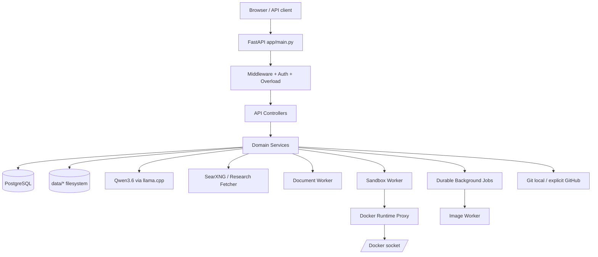
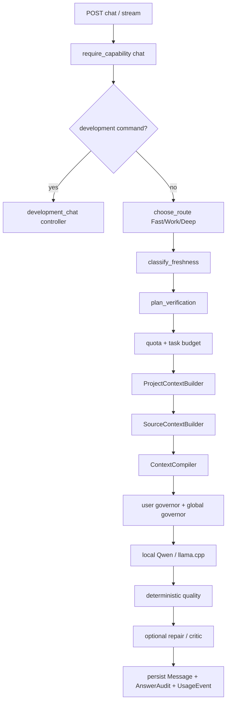
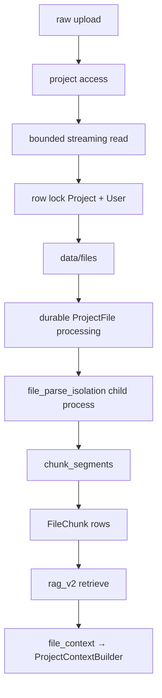

# OLYA AI / X1 — карта системы, контроллеров и связей

> **ОБЯЗАТЕЛЬНО ПРОЧИТАТЬ ПЕРЕД ИЗМЕНЕНИЕМ ПРОЕКТА.**  
> Этот файл — навигационная карта проекта для разработчиков и ИИ-агентов. Он отвечает на вопросы: **куда приходит запрос, какой контроллер его принимает, какой service выполняет бизнес-логику, какие ORM-модели/файлы/воркеры затрагиваются и где проходит граница безопасности**.
>
> Актуальность карты: 2026-09-12. Карта составлена по `main` после Sprint 69.
> **Правило проекта:** если в том же commit добавляется/удаляется controller, worker API, основной service, route prefix или меняется важная межмодульная связь — этот файл должен обновляться в том же commit.

---

## 1. Как пользоваться этой картой

Перед любой правкой сначала найдите путь функции по цепочке:

```text
UI / внешний API
        ↓
app/main.py
        ↓
middleware / auth / overload / capability
        ↓
app/api/routes/<controller>.py
        ↓
app/services/<service>.py
        ↓
ORM / filesystem / llama.cpp / SearXNG / worker
        ↓
response + audit + telemetry + durable state
```

Контроллеры должны оставаться HTTP-слоем: валидация HTTP-запроса, права, вызов service, перевод доменной ошибки в HTTP-код. Бизнес-логику нельзя копировать в новый controller, если соответствующий service уже существует.

Если задача связана с чатом — начинайте с `app/api/routes/chat.py`. Если с проектной разработкой — с `development_chat.py`, затем `development.py`, `engineering.py`, `execution.py`, `sandbox.py`, `git.py`. Если с файлами и RAG — с `files.py` → `file_parse_isolation.py` / `app/services/files.py` → `rag_v2.py` → `file_context.py`. Если с billing — с `commerce.py` → `billing.py` → `PaymentRecord` / `BillingCheckout` / `BillingSubscription` → measured quota. Если с релизом — с `reliability.py`, `launch.py`, `scripts/release_gate.py`, `scripts/rc_release_candidate.py`.

---

## 2. Карта системы за 30 секунд



Главная идея архитектуры: **FastAPI не должен напрямую владеть опасными внешними процессами**. LLM работает отдельным llama.cpp-процессом; LibreOffice — через document-worker; sandbox Docker — через sandbox-worker → минимальный docker-runtime-proxy; длительные image-задачи — через durable job queue.

---

## 3. Главные точки входа и source of truth

| Файл | Назначение |
|---|---|
| `app/main.py` | Единственная точка сборки FastAPI: lifespan, middleware, governors, concrete router registration, background loops. |
| `app/core/config.py` | Все runtime-настройки `X1_*`; лимиты CPU/RAM/context/files/research/sandbox/images/launch/billing. |
| `app/db.py` | SQLAlchemy engine, pool/deadlines, `SessionLocal`, `get_db`, `Base`. |
| `app/models.py` | Канонический ORM registry: readable core, migration-derived models и Sprint extensions. |
| `app/models_core.py` | Базовые ORM-модели и общий declarative helper. |
| `app/models_migrations.py` | Детерминированно сгенерированные ORM-модели из Alembic chain. |
| `app/schemas/*` | Pydantic HTTP/domain contracts. |
| `app/api/routes/*` | HTTP controllers. |
| `app/services/*` | Основная доменная логика. |
| `app/inference/client.py` | HTTP-клиент llama.cpp: chat, streaming, native tool turns. |
| `app/inference/router.py` | Fast / Work / Deep routing. |
| `docker-compose.yml` | Production topology и resource envelopes. |
| `model-manifest.json` | Пин модели Qwen/GGUF и контроль целостности. |
| `regression/golden_corpus.json` | Golden model/prompt regression cases. |
| `scripts/release_gate.py` | Полный release gate. |
| `scripts/rc_release_candidate.py` | Финальный RC gate целевого 32-GiB узла. |
| `ARCHITECTURE.md` | Историческая/концептуальная архитектура. Этот `PROJECT_SYSTEM_MAP.md` — оперативная карта текущего кода. |

### ORM registry

`app/models.py` собирает единый metadata graph из читаемых базовых моделей, детерминированного migration-derived registry и расширений:

```text
models_sprint27.py
models_sprint29.py
models_sprint30.py
models_sprint31.py
models_sprint37.py
models_sprint38.py
models_sprint45.py
models_sprint51.py
models_sprint53.py
models_sprint59.py
models_sprint61.py
models_sprint62.py
models_sprint69.py
```

`scripts/generate_orm_models.py --check` подтверждает, что `models_migrations.py` синхронизирован с Alembic. Sprint-owned таблицы `billing_checkouts` и `billing_subscriptions` зарегистрированы в `EXTERNAL_TABLES`, поэтому migration chain знает их DDL, а runtime ORM остаётся читаемым в `models_sprint69.py`. Все модули используют один `app.db.Base`.

Alembic имеет один непрерывный граф от `bff29ea4eab8` до единственного head `f69b2c4d8e10`. Чистый `upgrade head` создаёт 96 application tables, а `alembic check` не допускает расхождение DDL и ORM metadata.

---

## 4. Что создаёт `app/main.py`

Routers регистрируются как concrete routes через `_include_router_eager`. Это сохраняет dependency overrides FastAPI и одновременно делает `app.routes` полным источником для release-аудитов. Вложенные onboarding и image-editing routers подключаются явно, а не скрываются в lazy `_IncludedRouter`.

При старте приложения создаются и кладутся в `app.state`:

- `settings` — `Settings` из `app/core/config.py`;
- `llama` — `LlamaClient`;
- `context` — `ContextCompiler`;
- `governor` — глобальный bounded inference `ResourceGovernor`;
- `file_upload_governor` — отдельный admission для uploads;
- `user_governor` — per-user inference concurrency;
- `overload_lanes` — `chat`, `research`, `images`, `sandbox`;
- render gate документов;
- `research` — `ResearchFetcher`;
- `discovery` — `ProviderPoolDiscovery`, обычно `SearxngDiscovery`, опционально Brave.

В production запускаются фоновые циклы:

```text
beta_operations_loop
public_launch_watchdog_loop
maintenance_loop
```

Production startup fail-closed: SQLite, default admin token, default runtime/sandbox/document-worker secrets и некорректный worker URL блокируют запуск.

### Middleware до controllers

1. `RequestBodyLimitMiddleware` — общий streaming body limit, включая защиту от неоднозначного `Content-Length`.
2. `GZipMiddleware`.
3. `file_upload_admission` — ограничивает параллельные project uploads.
4. `graceful_overload_admission` — bounded lanes и circuit breaker до тяжёлой логики.
5. `privacy_headers` — no-store/noindex/security headers для `/v1`, `/app`, admin UI.

Global DB errors переводятся в контролируемые `409/503`, а не отдаются как raw trace.

---

# 5. Полный реестр HTTP controllers

Ниже перечислены controller-модули из `app/api/routes`.

## 5.1 Account / identity / projects

### `app/api/routes/auth.py` — `/v1/auth`

Назначение: регистрация, вход и lifecycle сессии. Основные endpoints: `register`, `login`, `me`, `logout`, `logout-all`.

```text
auth controller
 → auth_rate_limit
 → app.services.auth
 → User / AuthSession
 → PostgreSQL
```

Ключевые правила: пароль — scrypt; bearer token хранится в БД только как digest; login несуществующего пользователя выполняет dummy scrypt для уменьшения timing enumeration; session count ограничивается.

### `app/api/routes/account.py` — `/v1/account`

Назначение: экспорт пользовательских данных и деактивация аккаунта.

Связи: `User`, `AuthSession`, `Project`, `ProjectMember`, `Conversation`, `Message`, `ProjectMemory`, `ProjectFile`, `Task`, `TaskEvidence`, `UsageEvent`.

### `app/api/routes/projects.py` — `/v1/projects`

Назначение: CRUD проектов и участников, а также bounded project workspace snapshot.

```text
projects controller
 → access.py
 → project_workspace.py
 → Project / ProjectMember / User
 → Conversation / ProjectFile / ProjectMemory / Task / DevelopmentPlan
```

Owner создаёт проект. `viewer` читает, `member` работает, `manager` управляет проектом; membership меняет только owner. `GET /v1/projects/{project_id}/workspace` возвращает bounded previews и счётчики после canonical project RBAC.

### `app/api/routes/conversations.py` — `/v1/conversations`

Persisted chat history и conversation-memory. Models: `Conversation`, `Message`, `ConversationMemory`.

### `app/api/routes/memory.py` — `/v1/projects/{project_id}/memory`

Явная project memory key/value. Model: `ProjectMemory`. Viewer читает; member добавляет/обновляет/удаляет.

---

## 5.2 Chat / quality / usage / diagnostics

### `app/api/routes/chat.py` — `/v1`

**Главный пользовательский AI-controller.** Обслуживает обычный и streaming chat.



**Не создавайте альтернативный chat pipeline.** API key chat также вызывает этот controller.

### `app/api/routes/quality.py` — `/v1/quality`

Read-only пользовательский доступ к `AnswerAudit`.

### `app/api/routes/usage.py` — `/v1/usage`

Usage summary, текущий бюджет и budget preview. `budget-preview` использует тот же route/verification planning, что chat.

### `app/api/routes/diagnostics.py` — `/v1/diagnostics`

Ограниченный набор client-side frustration events через `app.services.diagnostics`.

---

## 5.3 Files / RAG / Internet research

### `app/api/routes/files.py` — `/v1/projects/...`

Project file lifecycle и lexical/RAG search.



Failed/timed-out/restart-interrupted rows остаются видимыми как `error` и не попадают в RAG. Manager retry использует immutable stored upload.

### `app/api/routes/research.py` — `/v1/research`

`ResearchSource` evidence APIs и persisted `ResearchRun` plan → discover → collect. Внешние URL идут только через SSRF-safe ResearchFetcher/discovery pipeline.

---

## 5.4 Canonical task engine

### `app/api/routes/tasks.py` — `/v1`

Server-owned task state machine и acceptance criteria. Models: `Task`, `TaskCriterion`, `TaskEvidence`, `TaskCheckpoint`. Используется optimistic `state_version`.

---

## 5.5 Code workspace / project development

### `app/api/routes/code.py` — `/v1/code`

Низкоуровневый workspace API и manual CodeAgentRun API. Современная implementation-цепочка проходит через engineering/execution/coding tools/sandbox.

### `app/api/routes/runtime.py` — `/v1/project-runtimes`

Runtime, snapshots и encrypted secrets. Models: `ProjectRuntime`, `ProjectRuntimeSnapshot`, `ProjectRuntimeSecret`, `CodeWorkspace`, `GitRepositoryBinding`.

### `app/api/routes/development.py` — `/v1/development-plans`

Высокоуровневый roadmap продукта и persisted sprints/work items/decisions/checkpoints.

### `app/api/routes/engineering.py` — `/v1/engineering-runs`

Роли инженерной команды поверх конкретного `DevelopmentWorkItem`; compute учитывается в task/quota.

### `app/api/routes/execution.py` — `/v1/engineering-executions`

**Канонический implementation + proof controller.** Model prose не является proof; proof строится из server-observed diff/tests/evidence.

### `app/api/routes/development_chat.py` — `/v1/development-chat`

Conversational control plane над development state machine; намеренно orchestrates engineering/execution.

### `app/api/routes/sandbox.py` — `/v1/project-sandboxes`

Persisted verification runs и internal previews через sandbox-worker → docker-runtime-proxy → Docker socket boundary.

### `app/api/routes/git.py` — `/v1/git`

Git lifecycle проекта. External GitHub writes требуют explicit confirmation; secret scan перед push; `.git` только local directory.

---

## 5.6 Documents

### `app/api/routes/documents.py` — `/v1/documents`

Document artifact/revision lifecycle, structural/render QA, bounded repair и release. Heavy rendering изолирован в document-worker.

---

## 5.7 Images / media

### `app/api/routes/images.py` — `/v1/images`

Пользовательская image generation через safety policy → BackgroundJob → image-worker → local backend → QA.

### `app/api/routes/media_admin.py` — `/v1/admin/media`

Media moderation, policy, training datasets и improvement workflow.

---

## 5.8 Commerce / billing / external API

### `app/api/routes/commerce.py` — `/v1/commerce`

Назначение: measured plans, resource economics, organizations, API keys, payment ingestion, API Console и Sprint 69 Billing/Subscriptions.

Models: `Organization`, `OrganizationMember`, `OrganizationBudget`, `ResourceExpenseEvent`, `PaymentRecord`, `ApiKey`, `ApiRequestTelemetry`, `BillingCheckout`, `BillingSubscription`, `UserQuota`.

Services: `commerce.py`, `measured_plans.py`, `billing.py`; HTML renderer API Console — `app/api_console.py`.

Payment ingest защищён `X-X1-Payment-Secret`. Generic provider event сначала проходит `ingest_payment()` с provider/idempotency uniqueness, затем `billing.apply_payment_record()` только если `metadata.checkout_id` ссылается на server-owned checkout.

Billing invariant:

```text
session user
 → POST /v1/commerce/billing/checkout {plan, idempotency_key}
 → server fixes amount/currency/expiry in BillingCheckout
 → provider confirms event
 → POST /v1/commerce/payments/ingest
 → PaymentRecord
 → lock BillingCheckout
 → exact user + amount + currency match
 → BillingSubscription
 → apply_runtime_plan_to_quota
```

Browser/provider не может прислать цену или entitlement в `BillingCheckoutCreate`: schema содержит только `plan` и `idempotency_key`. Один checkout имеет canonical `payment_record_id` и `refund_record_id`; replay того же provider event идемпотентен, а второй независимый payment/refund event отклоняется и его ledger insert откатывается.

Cancel использует `cancel_at_period_end`: уже оплаченный период не обрывается. `quota.get_or_create_quota()` вызывает `reconcile_user_subscription()`, поэтому истёкшая subscription при следующем canonical quota read переводится в `expired` и возвращает пользователя на Free. Full refund последнего оплаченного периода делает subscription `refunded` и сразу применяет Free; replay старого payment не восстанавливает entitlement.

Sprint 68 API Console остаётся management-plane над API keys/contexts/telemetry; Sprint 69 не создаёт второго payment/API engine.

### `app/api/routes/api_client.py` — `/v1/api`

Программный API поверх канонического Chat. API key request проходит strict credential grammar, organization access, rate window, rollout exposure, channel/org budgets, canonical Chat и telemetry. Persistent contexts bounded; Chat idempotent по `Idempotency-Key`/`client_request_id`.

---

## 5.9 Admin / safety / complaints / operations

### `app/api/routes/admin.py` — `/v1/admin`

Общий admin control plane: bootstrap, users/plans/quotas, sessions, frustration, search stats, audits/settings/performance.

### `app/api/routes/safety_admin.py` — `/v1/admin/safety`

Human safety/risk operations: `RiskEvent`, `SafetyCase`, `UserRestriction`, `LegalReview`, audited content access.

### `app/api/routes/complaints.py`

Confirmed user defect → `RegressionCase` → release blocker until accepted.

### `app/api/routes/operations_analytics.py` — `/v1/admin/operations`

Economics/resources/images/agents/health/overload and staged server optimization profiles.

### `app/api/routes/reliability.py` — `/v1/admin/reliability`

Production health и strict release readiness.

---

## 5.10 Beta / public rollout

### `app/api/routes/beta.py` — `/v1/admin/beta`

Closed-beta participant/wave/capacity operations.

### `app/api/routes/beta_ops.py`

Beta trends + feedback → Complaint Regression.

### `app/api/routes/launch.py`

Public eligibility и admin measured rollout/circuit breakers.

---

## 5.11 Health

### `app/api/routes/health.py`

- `GET /health` — дешёвый liveness.
- `GET /ready` — system readiness; `503` только при critical failure.

---

# 6. UI controllers

| Файл | Route | Назначение |
|---|---|---|
| `app/public_ui.py` | `/`, `/login`, `/register` | Публичный сайт и auth pages. |
| `app/user_ui.py` | `/app` | Основной workspace UI. |
| `app/admin_ui.py` | `/admin` | Operations/reliability/admin console. |
| `app/media_admin_ui.py` | `/admin/media` | Media moderation/policy/training. |
| `app/beta_admin_ui.py` | `/admin/beta` | Closed-beta waves/capacity/feedback. |
| `app/launch_admin_ui.py` | `/admin/launch` | Progressive rollout/measured plans. |

`app/api_console.py` — HTML renderer для `GET /v1/commerce/console`, не отдельный business controller. Billing Sprint 69 является API/service foundation; конкретный PSP и пользовательский checkout UI должны использовать `/v1/commerce/billing/*`, а не менять quota напрямую.

UI **не является source of truth бизнес-логики**.

---

# 7. Внутренние worker controllers

## 7.1 `app/sandbox_worker_api.py` — internal port 8090

`GET /health`, `GET /capabilities`, `POST /execute`, preview start/exec/stop. Без Docker socket.

## 7.2 `app/docker_runtime_proxy.py` — internal port 8092

**Единственный container с `/var/run/docker.sock`.** Разрешён минимальный Docker command grammar и повторная boundary validation.

## 7.3 `app/document_worker_api.py` — internal port 8091

LibreOffice + `pdftoppm` вне API process, canonical data namespace, path/symlink/page/DPI limits.

---

# 8. Service layer — где живёт логика

## Identity / permissions / safety

```text
access.py                  project role ACL
admin.py                   require_admin + audit
api_access.py              API-key scopes/rate admission
auth.py                    password/session/token auth
auth_rate_limit.py         pre-scrypt auth load shedding
safety.py                  capability restrictions / risk helpers
```

## Inference / context / answer quality

```text
app/inference/client.py        llama.cpp protocol/stream/tool calls
app/inference/router.py        Fast / Work / Deep routing
context.py                     context compilation/budget
project_context.py             project + history + memories + files
token_budget.py                context/token budgeting
scope_lock.py                  user instruction/output contract
quality.py                     deterministic audit + critic/repair prompts
conditional_verification.py    decide if extra verification is worth CPU
freshness.py                   current-information classification
source_context.py              trusted research evidence injection
```

## Memory / RAG / research

```text
long_term_memory.py
files.py
file_parse_isolation.py
file_context.py
rag_v2.py
research.py
research_planner.py
discovery.py
searxng_discovery.py
secret_redaction.py
```

## Tasks / jobs

```text
tasks.py                   task state/evidence/checkpoints
jobs.py                    durable background job leasing/retry
quota.py                   compute quota + paid subscription reconciliation
resource_governor.py       global bounded compute
user_resource_governor.py  per-user concurrency
overload.py                pre-route FIFO/fairness/circuit breaker
```

## Development / coding

```text
code_workspace.py
project_runtime.py
engineering.py
engineering_execution.py
coding_tools.py
tool_reliability.py
tool_agent.py
coding_agent.py
development.py
development_chat.py
autonomous_development.py
git_collaboration.py
sandbox.py
```

## Documents

```text
documents.py               DOCX build, structural/render QA, bounded repair
```

## Images

```text
image_policy.py
image_runtime.py
image_vision.py
image_learning.py
jobs.py
```

## Economics / billing / beta / launch / operations

```text
budget_transparency.py
commerce.py
billing.py                 checkout/subscription/payment settlement + quota entitlement
project_workspace.py
measured_plans.py
capacity.py
adaptive_capacity.py
beta.py
beta_trends.py
beta_scheduler.py
progressive_launch.py
public_launch_scheduler.py
operations_analytics.py
performance.py
system_observability.py
server_profiles.py
maintenance.py
complaint_regression.py
```

---

# 9. Основные межконтроллерные связи

### A. API client → Chat

```text
api_client.api_chat
 → chat.chat
 → canonical _chat_impl
```

### B. Chat → Development Chat

```text
chat._chat_impl
 → detect_command
 → development_chat.development_chat
```

### C. Development Chat → Engineering / Execution

```text
development_chat
 → engineering.execute_role
 → execution.execute
```

Billing не использует controller-to-controller import. `commerce.py` вызывает `billing.py`, а `billing.py` вызывает canonical measured-plan/quota service.

**Новые controller-to-controller imports без явной причины запрещены.**

---

# 10. Данные и файловое хранилище

```text
data/
├── files/
├── documents/
├── code_workspaces/
├── project_runtimes/
├── images/
└── server-profile-*.json

backups/
├── release-gate-latest.json
├── rc-release-candidate-latest.json
├── model-regression-baseline.json
├── model-regression-latest.json
├── restore-drill-latest.json
├── capacity-latest.json
└── backup sets

models/
└── Qwen3.6-35B-A3B-Q4_K_M.gguf
```

PostgreSQL хранит metadata/state, включая billing ledger/subscriptions/checkouts. Тяжёлые bytes остаются в filesystem namespaces.

---

# 11. Docker topology

| Service | Роль | Важная граница |
|---|---|---|
| `db` | PostgreSQL | bounded pool/deadlines. |
| `searxng` | web search discovery | внутренний 8080. |
| `app` | FastAPI control plane | без Docker socket. |
| `llama` | Qwen3.6 via llama.cpp | model volume read-only. |
| `sandbox-worker` | sandbox coordination | без Docker socket. |
| `docker-runtime-proxy` | Docker boundary | **единственный Docker socket owner**. |
| `document-worker` | LibreOffice/PDF rendering | отделён от API. |
| `image-worker` | durable image jobs | local model only. |
| `gate` | isolated release image | release checks. |

Внешний payment provider не является частью Docker trust chain X1: integration adapter подтверждает только provider event через защищённый `/v1/commerce/payments/ingest`; он не получает прямого доступа к PostgreSQL/UserQuota.

---

# 12. Background workers и scheduler loops

Внутри app: `beta_operations_loop`, `public_launch_watchdog_loop`, `maintenance_loop`. Отдельные процессы: image-worker, llama.cpp, sandbox-worker, document-worker, Docker runtime proxy, SearXNG.

Billing subscription expiry не требует отдельного scheduler: canonical quota read lazily reconciles period end. Это исключает ситуацию, когда временно упавший scheduler оставляет бессрочный paid entitlement.

---

# 13. Главные end-to-end сценарии

## 13.1 Обычный Chat

```text
/app → /v1/chat/stream → auth/exposure/overload → route/freshness/verification
 → project context + memory/RAG/research → governors → Qwen
 → quality → Message + AnswerAudit + UsageEvent
```

## 13.2 Интернет-ответ

```text
freshness → ResearchRun → SearXNG → SSRF-safe fetch → ResearchSource → Chat → quality
```

## 13.3 Работа с загруженным файлом

```text
upload → ProjectFile → isolated parser → FileChunk → rag_v2 → ProjectContext → Chat → validated file citations
```

## 13.4 Автономная разработка

```text
Project → CodeWorkspace → ProjectRuntime → DevelopmentPlan → Task
 → EngineeringRun → EngineeringExecution → sandbox proof → Evidence → local Git → optional explicit GitHub push
```

## 13.5 Документ

```text
DocumentSpec → Revision → DOCX → structural QA → document-worker render → visual QA → release
```

## 13.6 Изображение

```text
ImageGenerationCreate → safety → BackgroundJob → image-worker → local backend → QA → delivery
```

## 13.7 Публичный rollout

```text
beta telemetry + capacity + health + regressions → CapacityPlan/MeasuredPlanCatalog → PublicRollout → watchdog
```

## 13.8 API Console

```text
Browser session → /v1/commerce/console → session management calls
 → API secret only in page memory → /v1/api/* → canonical API/Chat pipeline
```

## 13.9 Billing / subscription

```text
user session
 → POST /v1/commerce/billing/checkout
 → BillingCheckout(server price snapshot)
 → provider
 → signed/shared-secret payment event
 → PaymentRecord(idempotent provider identity)
 → locked checkout exact-match validation
 → BillingSubscription
 → UserQuota(measured plan)
 → future quota reads reconcile expiry
```

Refund path:

```text
refund event → PaymentRecord → same locked checkout → canonical refund_record_id
 → if refunded period is current entitlement: BillingSubscription(refunded) → Free quota
 → payment replay cannot resurrect entitlement
```

---

# 14. Security boundaries, которые нельзя обходить

1. **Auth:** bearer session/API key только через существующие dependencies.
2. **Project ACL:** только `require_project_role`.
3. **Capability restriction:** chat/images/tools/research уважают restriction path.
4. **LLM:** production — локальный Qwen/llama.cpp; нет скрытого paid LLM fallback.
5. **Research:** внешние URL только через SSRF-safe ResearchFetcher.
6. **Filesystem:** canonical storage roots; symlink escape запрещён.
7. **Git:** external writes explicit; secret scan перед push.
8. **Sandbox:** только runtime proxy владеет Docker socket.
9. **Worker tokens:** не default в production.
10. **Secrets:** ProjectRuntimeSecret plaintext не возвращается API.
11. **Documents:** QA относится к конкретному SHA/revision.
12. **Coding proof:** model text не proof.
13. **Task completion:** required criteria/evidence обязательны.
14. **Release:** только green RC/reliability evidence.
15. **API key:** full secret только create/rotate/client memory.
16. **Billing:** browser/provider metadata не являются источником price/plan entitlement. Checkout price snapshot создаёт X1; settlement требует exact user/amount/currency и canonical payment/refund record. `UserQuota.plan` нельзя менять из callback напрямую.

---

# 15. Конкурентность и state ownership

```text
HTTP limit-concurrency
 → pre-route overload lanes
 → user governor
 → global inference governor
 → task/quota/channel budgets
 → worker-specific semaphores
 → Docker/OS limits
```

Billing concurrency: checkout creation защищён `(user_id,idempotency_key)` unique constraint + SAVEPOINT recovery; payment/refund settlement берёт row lock на checkout. Второй независимый settlement event откатывается вместе с новым `PaymentRecord`.

---

# 16. Где вносить изменение — быстрый указатель

| Нужно изменить | Сначала смотреть |
|---|---|
| Поведение ответа Chat | `chat.py` → context/quality/inference services |
| Fast/Work/Deep | `app/inference/router.py` |
| Streaming/Stop | `app/inference/client.py` + `chat.py` + `user_ui.py` |
| Memory | `long_term_memory.py`, `project_context.py`, `conversations.py`, `memory.py` |
| RAG по файлам | `files.py`, `file_parse_isolation.py`, `rag_v2.py`, `file_context.py` |
| Интернет/источники | `research.py`, `research_planner.py`, `discovery.py`, `source_context.py`, `freshness.py` |
| Проверка ответа | `quality.py`, `conditional_verification.py`, `scope_lock.py` |
| Проекты/роли | `projects.py`, `access.py` |
| Tasks | `tasks.py` controller + service |
| Code workspace | `code.py`, `code_workspace.py` |
| Автономная разработка | `development_chat.py`, `autonomous_development.py`, `development.py` |
| Engineering | `engineering.py`, `execution.py`, coding services |
| Sandbox | `sandbox.py`, `sandbox_worker_api.py`, `docker_runtime_proxy.py` |
| Git/GitHub | `git.py`, `git_collaboration.py`, `project_runtime.py` |
| DOCX/PDF | `documents.py`, `document_worker_api.py` |
| Images | `images.py`, image services, `scripts/image_worker.py` |
| Media moderation/training | `media_admin.py`, `image_learning.py` |
| Тарифы/экономика | `commerce.py`, `billing.py`, `measured_plans.py`, `quota.py`, `budget_transparency.py` |
| Public API / API Console | `api_client.py`, `commerce.py`, `app/api_console.py` |
| Billing checkout/subscription/refund | `commerce.py` → `billing.py` → `models_sprint69.py`; provider ledger остаётся `PaymentRecord` |
| Beta | `beta.py`, `adaptive_capacity.py`, `beta_scheduler.py` |
| Public rollout | `launch.py`, `progressive_launch.py`, `public_launch_scheduler.py` |
| Reliability | `reliability.py`, `system_observability.py` |
| Safety/restrictions | `safety_admin.py`, `safety.py` |
| Production startup | `app/main.py`, `config.py`, `docker-compose.yml`, `scripts/install.sh` |
| Финальный релиз | `scripts/release_gate.py`, `scripts/rc_release_candidate.py` |

---

# 17. Release/test hierarchy

```text
compileall / static contract
 → canonical source + product/API/billing contract audits
 → pytest current suite
 → immutable legacy regression suite
 → rc_security_audit
 → model regression
 → Docker build + migrations
 → component acceptance
 → backup + restore drill
 → load + long-context + capacity
 → E2E + chaos
 → /ready
 → rc_release_candidate == passed
```

Sprint 69 добавляет `scripts.billing_contract_audit` в `scripts.run_full_regression`: route permanence, server-owned checkout fields, exact settlement guards, refund idempotency, quota reconciliation и ORM ownership являются release contract.

---

# 18. Правила для разработчика или ИИ-агента

Перед изменением: найти controller/service/ORM/storage/worker boundary, ACL/quota/overload и existing tests. После изменения: обновить schemas/tests/system map, проверить security boundary, один Alembic head и release gates.

---

# 19. Что является намеренной архитектурой

- один FastAPI worker для authoritative in-memory governors дешёвого single node;
- Qwen/llama.cpp отдельным process;
- SearXNG discovery + persisted research evidence;
- Task/Engineering/Execution разделены по ответственности;
- sandbox-worker и docker-runtime-proxy разделены для socket isolation;
- document-worker и BackgroundJob изолируют тяжёлые задачи;
- model/prompt golden corpus и complaints→regression входят в release contract;
- progressive rollout/circuit breakers ограничивают blast radius;
- BillingCheckout отделён от PaymentRecord: checkout — server-owned commercial intent, PaymentRecord — provider-neutral immutable event identity, BillingSubscription — entitlement lifecycle.

---

# 20. Антипаттерны, которые нельзя добавлять

```text
❌ новый /chat-v2 с собственной логикой
❌ прямой network fetch произвольного user URL вне ResearchFetcher
❌ Docker socket в app или sandbox-worker
❌ shell=True для пользовательской/agent команды
❌ произвольный host path из HTTP payload
❌ plaintext secrets в response/log
❌ API-secret в localStorage/sessionStorage
❌ auto GitHub push после model generation
❌ "tests passed" из текста LLM без server result
❌ завершение Task без criteria/evidence
❌ отдельный API Chat pipeline
❌ public rollout без green guardrails
❌ цена/валюта checkout из браузерного payload
❌ plan/entitlement напрямую из provider metadata/callback
❌ изменение UserQuota.plan до exact verified BillingCheckout settlement
❌ повторный payment/refund event, который повторно меняет entitlement или ledger economics
```

---

# 21. Краткий dependency graph по доменам

```text
AUTH
User ─ AuthSession ─ auth.py

PROJECT
Project ─ ProjectMember ─ access.py
   ├─ Conversation / Memory
   ├─ ProjectFile ─ FileChunk ─ RAG
   ├─ Task ─ Evidence
   ├─ CodeWorkspace ─ Runtime ─ Git
   ├─ DevelopmentPlan ─ EngineeringRun ─ Execution
   ├─ ResearchRun/ResearchSource
   └─ Document / Image

CHAT
Chat → Route → Context → Memory/RAG/Research → Qwen → Quality → Audit/Usage

BILLING
User → BillingCheckout → PaymentRecord → BillingSubscription → UserQuota → MeasuredPlan

DEV
DevelopmentChat → DevelopmentPlan → EngineeringRun → Execution → Sandbox → Evidence → Git

OPS
Usage/Frustration/Health/Complaints → Beta/Capacity → MeasuredPlanCatalog → PublicRollout → RC
```

---

## 22. Финальное правило

Если разработчик или ИИ не понимает, где реализовывать функцию, **не начинать с создания нового файла**. Сначала пройти карту сверху вниз и найти существующего владельца ответственности.

Если владельца действительно нет — новый модуль должен иметь одно чёткое назначение, быть подключён к существующим ACL/quota/audit/worker boundaries, иметь tests и быть добавлен в `PROJECT_SYSTEM_MAP.md` в том же commit.
